<picture>
  <source media="(prefers-color-scheme: dark)" srcset="./.github/assets/header-en-dark.svg">
  <source media="(prefers-color-scheme: light)" srcset="./.github/assets/header-en-light.svg">
  
</picture>

[Português](./README.md) · **English** · [Español](./README.es.md)

**[Portfolio](https://samuelmauli.github.io/portifolio/)** · [LinkedIn](https://www.linkedin.com/in/samuelmauli/) · [samuel.mauli@gmail.com](mailto:samuel.mauli@gmail.com) · Curitiba, Brazil

---

I take a product from design to production — and then keep it running.

I pick the language for the problem, not for the trend: **Go** where idempotency and concurrency matter (bank payment orchestration, billing), **Python** where the data and ML ecosystem wins (PostGIS, XGBoost, vLLM), **Node/TypeScript** where the whole team shares types with the front end. On mobile, **React Native** and **Flutter**, with six apps shipped to both stores — including the hard parts: APNs directly when the Firebase project got corrupted on iOS, signed builds without a managed pipeline.

I apply AI where it moves a measurable number, and preferably **inside the client's perimeter**: multilingual embeddings on ONNX Runtime inside the Node process itself, LLMs served by on-premise vLLM, XGBoost with mandatory SHAP whenever the decision ends up in an audit.

I am also the SRE of my own operation: I migrated everything from EC2 to a VPS and today run ~20 processes for eight businesses behind Caddy, with Prometheus/Grafana/Loki and **proven PITR** — a restore landed `1.2s` from the target, RTO measured at `38min`. A backup with no tested restore is not a backup.

---

## Sectors I deliver into

I don't write generic software: every product below carries the regulation, the authority and the vocabulary of its sector.

| Sector | Business domain | Regulation and official source I work against |
|---|---|---|
| **Agribusiness / ESG** | Environmental certification of rural property, supply-chain traceability | Brazilian Forest Code (Law 12.651/12) · CAR · PRODES / DETER · IBAMA · INCRA · FUNAI · ICMBio · EUDR |
| **Public sector** | Public tendering, government contracting, capital and funding | Law 14.133/21 · PNCP · Comprasnet · TCU case law |
| **Financial** | Payment orchestration at scale, bank reconciliation | PIX (Brazilian Central Bank) · CNAB 240 · mTLS per bank connection · immutable audit trail |
| **Legal and accounting** | Litigation risk provisioning, judicial deposits and writs | CPC 25 / IAS 37 · DataJud/CNJ · PROJUDI · ICP-Brasil A1 digital signature |
| **Energy** | Subscription distributed generation, condominium cost sharing | Utility invoices · tariff flags · energy credits · individual metering |
| **Occupational health** | Psychosocial risk and HR action plans | NR-01 · COPSOQ III taxonomy · LGPD (Brazilian GDPR) with sensitive data |
| **Mobility** | School transport: guardian, driver and route | LGPD involving minors · versioned consent served by the backend |
| **Industry and logistics** | Gatehouse, freight scheduling and access control | Invoice (NF-e) validation · visitor credentialing and audit trail |

---

## In production

Twenty-two systems in production today: the proprietary Doublethree catalogue plus the platforms I lead at Grupo Negócios Públicos. Twelve of them in detail below.

### Agribusiness and ESG

**Terra-fy** — Farmers and trading companies must **prove environmental compliance to sell, finance and export**, and today that costs weeks of consulting. The platform cross-checks the official CAR geometry against nine federal databases and issues the certificate in under 5 minutes after payment, signed with ICP-Brasil A1 and verifiable by QR and hash. It unlocks rural credit, M&A due diligence and the traceability requirement of the European market.
`FastAPI` `PostGIS` `MapLibre` `pyHanko`

### Public sector

**Licitaqui** — Companies that sell to the government burn expensive team hours reading tenders they cannot win. The agent continuously reads everything published in Brazil, surfaces only the winnable ones and **quotes the literal passage that proves each requirement** — a go/no-go decision in minutes, fewer disqualifications over a compliance detail, and challenge risk mapped before the bid.
`Next.js` `pgvector` `Playwright` `on-prem LLM`

**Aportia** — Companies chasing capital or public funding don't know where they stand a real chance and miss deadlines on the wrong call. The platform monitors official sources and returns an **explainable fit score, criterion by criterion**. The LLM key belongs to the client (BYOK): their business plan never leaves their own account.
`Next.js` `Prisma` `BM25 + embeddings`

### Financial

**PaymentsHub** — A company paying hundreds of suppliers a day runs on spreadsheets and internet banking, where one duplicate payment is a direct loss. The orchestrator ingests the batch from the ERP, pre-validates against the bank's API, **requires human approval with RBAC authority levels**, then executes over PIX REST or CNAB 240 batches through audited SFTP. Per-payment idempotency and an immutable end-to-end trail.
`Go` `PostgreSQL` `River` `MinIO`

### Legal and accounting

**Lexis Predict** — Contingency provisioning usually comes from the legal team's gut feeling, and the auditor asks for criteria. The model classifies litigation risk under CPC 25 / IAS 37 with **mandatory per-feature explanation (SHAP)** and runs 100% on-premise: no case document ever reaches a third-party AI. Below `0.70` confidence, a human decides.
`Python` `XGBoost` `vLLM` `k3s`

**Lexis Vault** — Judicial deposits get lost between the bank and the court: the statement speaks in deposit IDs, the court speaks in case numbers. Vault ties the two together through CNAB 240 over SFTP, DataJud/CNJ and PROJUDI, and **recovers idle funds and unclaimed writs** — month-end close without manual digging.
`FastAPI` `Airflow` `Kubernetes`

### Energy

**Wave Energia** — Subscribers want the discount on their bill and the operator needs to bill correctly, but the data depends on utilities that go down. **Three integrations in contingency** guarantee invoice capture, with batch reconciliation, utility PDF parsing, tariff flags and energy credits. Mobile app on both stores plus the API running the operation.
`React Native` `Node.js` `AWS`

**AmperCondo** — Cost sharing by ownership fraction makes light users pay for their neighbours, and the argument returns at every assembly. Individual metering, configurable tariffs and **per-unit billing with automatic settlement** via bank slip or PIX. Schema-based multi-tenancy and idempotent billing: the same meter reading is never charged twice.
`Go (hexagonal)` `PostgreSQL` `Asaas`

### Occupational health

**OnMe** — Brazilian regulation NR-01 now requires psychosocial risk management and HR has no instrument for it. The platform measures with the **COPSOQ III** taxonomy, delivers the action plan in the hierarchy the norm demands, and keeps sensitive data inside the server: embeddings run on ONNX inside the Node process, with no third-party AI call. Employee app, HR dashboard and an ML engine on a single backend.
`NestJS` `React Native` `ONNX Runtime`

### Mobility

**Vanlink** — The guardian wants to know where the van is right now, and the company must prove LGPD consent involving minors. Two Flutter apps in production on both stores with **real-time tracking, versioned consent served by the backend** and geocoding with cross-validation of the school address. Fewer calls to the office, less legal exposure.
`Flutter` `APNs` `FCM`

### Industry, logistics and agencies

**LogiSentry** — Industrial gatehouses queue trucks and log visitors on paper. Freight, visitor and room scheduling in a single gatehouse, with a **kiosk PWA running on the reception tablet** and an auditable trail of who came in. Multi-tenant, five languages.
`Turborepo` `NestJS` `Next.js` `Stripe`

**Cadência** — Agencies work outside the office and lose follow-ups until they get back to the CRM. A mobile CRM on both stores, **white-label**: each agency signs in through its own subdomain, under its own brand. Pipeline updated in front of the client, not at the end of the day.
`React Native` `Expo Router` `NestJS`

**The infrastructure behind all of it:** one 8 vCPU / 32 GB VPS, ~20 processes across eight businesses behind Caddy with a DNS-01 wildcard, full observability and proven PITR.

---

## How I work

- **Sensitive data does not leave the perimeter.** Occupational health, accounting provisioning and tender analysis run on local models — ONNX in-process, on-premise vLLM, or BYOK with the client's own key. Privacy as architecture, not as a contract clause.
- **Money demands idempotency and a trail.** No reading is billed twice, no batch is paid twice: per-payment idempotency keys, human approval with RBAC and an immutable event log end to end.
- **Automated decisions must be auditable.** If the output goes into an audit, it ships with its explanation — SHAP over features, the literal quote from the tender, a hash verifiable offline. Below the confidence threshold, a human decides.
- **A backup with no tested restore is not a backup.** PITR proven with `recovery_target_time`, RTO measured rather than assumed.
- **Shipping an app is the full cycle.** Version bump, signed build, upload through the ASC API and the Play Developer API, submission for review — no managed pipeline in between.

---

## Stack

| Layer | Tools |
|---|---|
| **Languages** | Go · TypeScript · Python · Java · PHP · Dart · Rust · C++ · Kotlin · Swift · SQL |
| **Backend** | NestJS · Node · FastAPI · Flask · Spring Boot · Hibernate/JPA · Laravel · Slim · Go (hexagonal, River) |
| **Front end** | Next.js · React · Vue · Tailwind · Turborepo · PWA · Vite |
| **Mobile** | React Native (bare + Expo Router) · Flutter · SwiftUI · Jetpack Compose · APNs · FCM · ASC API + Play Developer API |
| **Data** | PostgreSQL · PostGIS · pgvector · MySQL · MongoDB · Redis · DuckDB · Redshift · Prisma · Drizzle · Airflow |
| **AI / ML** | XGBoost · LightGBM · SHAP · scikit-learn · TensorFlow · PyTorch · OpenCV · ONNX Runtime · vLLM · Ollama · BGE-M3 · RAG (BM25 + embeddings) · Claude / GPT / Gemini / Groq |
| **Infra / SRE** | Docker · Kubernetes and k3s · Caddy · Nginx · PM2 · GitHub Actions · AWS · Cloudflare · Prometheus · Grafana · Loki · Alertmanager · PITR |
| **Integrations** | PIX · CNAB 240 · mTLS · SFTP · Asaas · Stripe · Banco Inter · RabbitMQ · WebSocket · ICP-Brasil A1 · DataJud/CNJ · PNCP / Comprasnet |
| **Quality** | Playwright · Jest · Vitest · pytest · JUnit |

---

## On GitHub

| Repository | |
|---|---|
| [**Quimera**](https://github.com/SamuelMauli/Quimera) | C++ chess engine with predictive opponent modelling |
| [**Rust-LavaLamp**](https://github.com/SamuelMauli/Rust-LavaLamp) | Cryptographic entropy from images, along the lines of Cloudflare's LavaRand |
| [**GreenChain**](https://github.com/SamuelMauli/GreenChain-Backend) | Blockchain traceability + geoprocessing for EUDR compliance ([front end](https://github.com/SamuelMauli/GreenChain-Frontend)) |
| [**Curitiba-Verde**](https://github.com/SamuelMauli/Curitiba-Verde) | Deforestation mapping through computer vision and NDVI |
| [**LibrasNow**](https://github.com/SamuelMauli/LibrasNow) | Real-time sign language translation at the edge |
| [**wselect-pro**](https://github.com/SamuelMauli/wselect-pro) | LMS in production, deployed through GitHub Actions |
| [**EBANX Take-Home**](https://github.com/SamuelMauli/EBANX-Take-Home-API) | Banking API in PHP 8.2 + Slim 4 |

---

## Career

```
2025 →      Mid-level Developer · Grupo Negócios Públicos (Vanlink)
            SGI + CRM, two Flutter apps on the stores, payment orchestration,
            LLM document extraction: 8 min → 10 s per document

2024 →      Developer & Consultant · Doublethree
            Ten proprietary products from design to production, six apps shipped,
            AWS → VPS migration and the whole operation kept running

2024–2025   Java & PHP Developer · Meisters Solutions
            Spring Boot and Laravel, ETL/ELT pipelines for pharma,
            BlauSight (generative AI) and Ballesol CareAI (Spain)

2023–2024   IT Support Agent · Positivo Tecnologia — ITIL, SLA, IMC backlog
2023        Oracle Consultant · TRI CS Inc. — OIC, BI Publisher, REST/SOAP
2022–2023   N1 Support · ICI Curitiba — City of Curitiba, NOC and field teams
```

Trilingual: Portuguese, English and Spanish — with software running in production in Brazil, Spain and Mexico.

---

Open to challenging projects and partnerships — [samuel.mauli@gmail.com](mailto:samuel.mauli@gmail.com)
