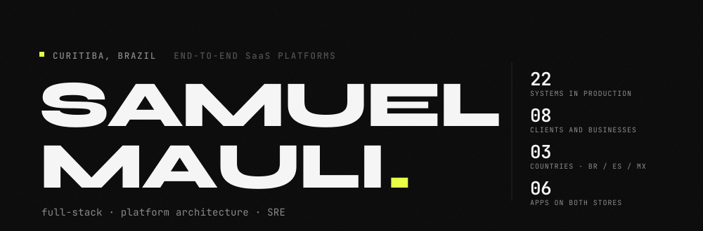

<picture>
  <source media="(prefers-color-scheme: dark)" srcset="./.github/assets/header-en-dark.svg">
  <source media="(prefers-color-scheme: light)" srcset="./.github/assets/header-en-light.svg">
  
</picture>

[Português](./README.md) · **English** · [Español](./README.es.md)

**[Portfolio](https://samuelmauli.github.io/portifolio/)** · [LinkedIn](https://www.linkedin.com/in/samuelmauli/) · [samuel.mauli@gmail.com](mailto:samuel.mauli@gmail.com) · Curitiba, Brazil

---

I take a product from design to production — and then keep it running. I pick the language for the problem: **Go** where idempotency and concurrency matter (payment, billing), **Python** where data and ML govern (PostGIS, XGBoost, vLLM), **Node/TypeScript** where front and back share types. AI only where it moves a number — and preferably **inside the client's perimeter** (ONNX in the process, vLLM on-premise, BYOK). And I operate what I build: full observability and restore that's tested, not assumed.

## Results I delivered

| Delivery | Metric |
|---|---|
| Rural environmental compliance (9 federal databases) → signed certificate | **weeks → < 5 min** |
| Document extraction with LLM in banking ERP | **8 min → 10 s** per document |
| Production restore with proven PITR | **1.2 s from target · RTO 38 min** |
| Apps published and maintained on both stores | **6 apps · iOS + Android** |
| Energy invoice capture with contingency integration | **3 sources · zero billing gap** |
| Batch payment with idempotency and immutable trail | **0 duplicate payments** |

---

## Sectors I deliver into

I don't write generic software: every product carries the regulation, the authority and the vocabulary of its sector.

| Sector | Domain | Regulation and official source |
|---|---|---|
| **Agribusiness / ESG** | Environmental certification of rural property, supply-chain traceability | Law 12.651/12 · CAR · PRODES/DETER · IBAMA · INCRA · FUNAI · EUDR |
| **Public sector** | Public tendering, government contracting, funding | Law 14.133/21 · PNCP · Comprasnet · TCU |
| **Financial** | Payment orchestration at scale, reconciliation | PIX (Central Bank) · CNAB 240 · mTLS per bank · immutable trail |
| **Legal / accounting** | Litigation risk provisioning, judicial deposits | CPC 25 / IAS 37 · DataJud/CNJ · PROJUDI · ICP-Brasil A1 |
| **Energy** | Distributed generation by subscription, condominium cost sharing | Utility invoice · tariff flag · individual metering |
| **Occupational health** | Psychosocial risk and HR action plan | NR-01 · COPSOQ III · LGPD with sensitive data |
| **Mobility** | School transport: guardian, driver, route | LGPD with minors · versioned consent in backend |
| **Industry / logistics** | Gatehouse, freight scheduling, access control | NF-e validation · visitor audit trail |

---

## In production

I keep systems in production across several sectors — agri and ESG, public sector, finance, legal, energy, occupational health, mobility and industry. The work spans APIs and web platforms to mobile apps published on both stores, always from design to operation.

---

## Principles

- **Integrity** — I do the right thing even when no one is watching, and I don't promise what I can't deliver.
- **Communication** — I say early what I know and what I don't; aligning expectations is part of the work, not an interruption of it.
- **Transparency** — I show real progress, including what went wrong. No sugar-coating status.
- **Commitment** — I own the outcome, not just my slice; I stay until the delivery stands on its own.
- **Respect** — for the time, the context and the people on every team I work with.

---

## Stack

| Layer | Tools |
|---|---|
| **Languages** | Go · TypeScript · Python · Java · PHP · Dart · Rust · C++ · Kotlin · Swift · SQL |
| **Backend** | NestJS · Node · FastAPI · Flask · Spring Boot · Hibernate/JPA · Laravel · Slim · Go (hexagonal, River) |
| **Front end** | Next.js · React · Vue · Tailwind · Turborepo · PWA · Vite |
| **Mobile** | React Native (bare + Expo Router) · Flutter · SwiftUI · Jetpack Compose · APNs · FCM · ASC API + Play Developer API |
| **Data** | PostgreSQL · PostGIS · pgvector · MySQL · MongoDB · Redis · DuckDB · Redshift · Prisma · Drizzle · Airflow |
| **AI / ML** | XGBoost · LightGBM · SHAP · scikit-learn · TensorFlow · PyTorch · OpenCV · ONNX Runtime · vLLM · Ollama · BGE-M3 · RAG (BM25 + embeddings) · Claude / GPT / Gemini / Groq |
| **Infra / SRE** | Docker · Kubernetes / k3s · Caddy · Nginx · PM2 · GitHub Actions · AWS · Cloudflare · Prometheus · Grafana · Loki · Alertmanager · PITR |
| **Integrations** | PIX · CNAB 240 · mTLS · SFTP · Asaas · Stripe · Banco Inter · RabbitMQ · WebSocket · ICP-Brasil A1 · DataJud/CNJ · PNCP/Comprasnet |
| **Quality** | Playwright · Jest · Vitest · pytest · JUnit |

---

## On GitHub

| Repository | |
|---|---|
| [**GreenChain**](https://github.com/SamuelMauli/GreenChain-Backend) | Supply-chain traceability on Hyperledger Fabric + geoprocessing for EUDR compliance ([front](https://github.com/SamuelMauli/GreenChain-Frontend)) |
| [**Quimera**](https://github.com/SamuelMauli/Quimera) | Chess engine in C++ with opponent predictive modeling |
| [**Rust-LavaLamp**](https://github.com/SamuelMauli/Rust-LavaLamp) | Cryptographic entropy from images, in the vein of Cloudflare's LavaRand |
| [**Curitiba-Verde**](https://github.com/SamuelMauli/Curitiba-Verde) | Deforestation mapping through computer vision and NDVI |
| [**LibrasNow**](https://github.com/SamuelMauli/LibrasNow) | Real-time sign language translation at the edge |
| [**wselect-pro**](https://github.com/SamuelMauli/wselect-pro) | LMS in production, deployed via GitHub Actions |
| [**EBANX Take-Home**](https://github.com/SamuelMauli/EBANX-Take-Home-API) | Banking API in PHP 8.2 + Slim 4 |

---

## Career

```
2025 →      Mid-level Developer · Grupo Negócios Públicos (Vanlink)
            SGI + CRM, 2 Flutter apps on the stores, payment orchestration,
            LLM document extraction: 8 min → 10 s per document

2024 →      Developer & Consultant · Doublethree
            Proprietary products from design to production,
            apps published on the stores

2024–2025   Java & PHP Developer · Meisters Solutions
            Spring Boot and Laravel, ETL/ELT for pharma,
            BlauSight (generative AI) and Ballesol CareAI (Spain)

2023–2024   IT Support Agent · Positivo Tecnologia — ITIL, SLA, IMC backlog
2023        Oracle Consultant · TRI CS Inc. — OIC, BI Publisher, REST/SOAP
2022–2023   N1 Support · ICI Curitiba — City of Curitiba, NOC and field
```

Trilingual (Portuguese · English · Spanish), with software in production in Brazil, Spain and Mexico.

---

Open to challenging projects and partnerships — [samuel.mauli@gmail.com](mailto:samuel.mauli@gmail.com)
