<picture>
  <source media="(prefers-color-scheme: dark)" srcset="./.github/assets/header-es-dark.svg">
  <source media="(prefers-color-scheme: light)" srcset="./.github/assets/header-es-light.svg">
  
</picture>

[Português](./README.md) · [English](./README.en.md) · **Español**

**[Portafolio](https://samuelmauli.github.io/portifolio/)** · [LinkedIn](https://www.linkedin.com/in/samuelmauli/) · [samuel.mauli@gmail.com](mailto:samuel.mauli@gmail.com) · Curitiba, Brasil

---

Llevo el producto del diseño a producción — y después lo mantengo en pie.

Elijo el lenguaje por el problema, no por la moda: **Go** donde importan la idempotencia y la concurrencia (orquestación bancaria, facturación), **Python** donde manda el ecosistema de datos y ML (PostGIS, XGBoost, vLLM), **Node/TypeScript** donde todo el equipo comparte tipos con el front. En móvil, **React Native** y **Flutter**, con seis apps publicadas en las dos tiendas — incluidos los casos difíciles: APNs directo cuando el proyecto de Firebase se corrompió en iOS, build firmado sin pipeline gestionado.

Aplico IA donde mueve un número medible, y de preferencia **dentro del perímetro del cliente**: embeddings multilingües en ONNX Runtime dentro del propio proceso Node, LLM servido por vLLM on-premise, XGBoost con SHAP obligatorio cuando la decisión termina en una auditoría.

También soy el SRE de mi propia operación: migré todo de EC2 a un VPS y hoy sostengo ~20 procesos de ocho negocios detrás de Caddy, con Prometheus/Grafana/Loki y **PITR probado** — un restore se detuvo a `1,2s` del objetivo, con RTO medido en `38min`. Un backup sin restore probado no es un backup.

---

## Sectores en los que entrego

No escribo software genérico: cada producto de abajo carga la norma, el organismo y el vocabulario de su sector.

| Sector | Dominio de negocio | Regulación y fuente oficial con la que trabajo |
|---|---|---|
| **Agronegocio / ESG** | Certificación socioambiental de predio rural, trazabilidad de cadena | Código Forestal (Ley 12.651/12) · CAR · PRODES / DETER · IBAMA · INCRA · FUNAI · ICMBio · EUDR |
| **Sector público** | Licitación, contratación pública, capital y fomento | Ley 14.133/21 · PNCP · Comprasnet · jurisprudencia del TCU |
| **Financiero** | Orquestación de pagos a escala, conciliación bancaria | PIX (Banco Central de Brasil) · CNAB 240 · mTLS por conexión bancaria · traza de auditoría inmutable |
| **Jurídico y contable** | Provisión de riesgo procesal, depósito judicial y libramiento | CPC 25 / IAS 37 · DataJud/CNJ · PROJUDI · firma ICP-Brasil A1 |
| **Energía** | Generación distribuida por suscripción, prorrateo en condominios | Factura de distribuidora · bandera tarifaria · crédito de energía · medición individualizada |
| **Salud ocupacional** | Riesgo psicosocial y plan de acción de RR. HH. | NR-01 · taxonomía COPSOQ III · LGPD (RGPD brasileño) con dato sensible |
| **Movilidad** | Transporte escolar: responsable, conductor y ruta | LGPD con menores de edad · consentimiento versionado servido por el backend |
| **Industria y logística** | Portería, agendamiento de carga y control de acceso | Validación de factura (NF-e) · acreditación y traza de visitantes |

---

## En producción

Productos que arquitecté, construí y mantengo en pie — diez propios, más las plataformas que lidero en Grupo Negócios Públicos.

### Agronegocio y ESG

**Terra-fy** — El productor rural y las tradings necesitan **probar conformidad ambiental para vender, financiar y exportar**, y hoy eso cuesta semanas de consultoría. La plataforma cruza la geometría oficial del CAR contra nueve bases federales y emite el certificado en menos de 5 minutos tras el pago, firmado con ICP-Brasil A1 y verificable por QR y hash. Destraba crédito rural, due diligence de M&A y la exigencia de trazabilidad del mercado europeo.
`FastAPI` `PostGIS` `MapLibre` `pyHanko`

### Sector público

**Licitaqui** — La empresa que vende al Estado quema horas caras de equipo leyendo pliegos que no puede ganar. El agente lee de forma continua todo lo que se publica en Brasil, entrega solo lo ganable y **cita el fragmento literal que prueba cada exigencia** — decisión de participar en minutos, menos inhabilitaciones por un detalle y riesgo de impugnación mapeado antes de la oferta.
`Next.js` `pgvector` `Playwright` `LLM on-prem`

**Aportia** — Quien busca capital o fomento no sabe dónde tiene una posibilidad real y pierde plazos en la convocatoria equivocada. La plataforma monitorea las fuentes oficiales y devuelve un **score de fit explicable criterio por criterio**. La clave del LLM es del propio cliente (BYOK): el análisis de su plan de negocio nunca sale de su cuenta.
`Next.js` `Prisma` `BM25 + embeddings`

### Financiero

**PaymentsHub** — La empresa que paga a cientos de proveedores por día opera con planilla y banca por internet, donde un pago duplicado es pérdida directa. El orquestador recibe el lote del ERP, prevalida contra la API del banco, **exige aprobación humana con niveles de autoridad (RBAC)** y ejecuta por PIX REST o lote CNAB 240 vía SFTP auditado. Idempotencia por pago y traza inmutable de punta a punta.
`Go` `PostgreSQL` `River` `MinIO`

### Jurídico y contable

**Lexis Predict** — La provisión de contingencias suele salir del criterio informal del área legal, y el auditor exige método. El modelo clasifica el riesgo procesal bajo CPC 25 / IAS 37 con **explicación obligatoria por feature (SHAP)** y corre 100% on-premise: ninguna pieza procesal sale hacia una IA de terceros. Por debajo de `0,70` de confianza, decide una persona.
`Python` `XGBoost` `vLLM` `k3s`

**Lexis Vault** — El depósito judicial se pierde entre el banco y el tribunal: el extracto habla en ID de depósito, el expediente habla en número de causa. Vault ata ambos con CNAB 240 por SFTP, DataJud/CNJ y PROJUDI, y **recupera dinero inmovilizado y libramientos no cobrados** — cierre de mes sin rastreo manual.
`FastAPI` `Airflow` `Kubernetes`

### Energía

**Wave Energia** — El suscriptor quiere el descuento en su cuenta y la operadora necesita facturar bien, pero el dato depende de distribuidoras que se caen. **Tres integraciones en contingencia** garantizan la captura de la factura, con reconciliación por lotes, lectura de PDF de la distribuidora, bandera tarifaria y crédito de energía. App en las dos tiendas más la API que sostiene la operación.
`React Native` `Node.js` `AWS`

**AmperCondo** — El prorrateo por fracción ideal hace que quien consume poco pague por el vecino, y la discusión vuelve en cada asamblea. Medición individualizada, tarifa configurable y **cobro por unidad con conciliación automática** por boleto o PIX. Multi-tenant por schema y facturación idempotente: la misma lectura nunca se cobra dos veces.
`Go (hexagonal)` `PostgreSQL` `Asaas`

### Salud ocupacional

**OnMe** — La norma brasileña NR-01 pasó a exigir gestión de riesgo psicosocial y RR. HH. no tiene instrumento para eso. La plataforma mide con la taxonomía **COPSOQ III**, entrega el plan de acción en la jerarquía que la norma exige y mantiene el dato sensible dentro del servidor: los embeddings corren en ONNX dentro del proceso Node, sin ninguna llamada a IA de terceros. App del colaborador, panel de RR. HH. y motor de ML sobre un único backend.
`NestJS` `React Native` `ONNX Runtime`

### Movilidad

**Vanlink** — El responsable quiere saber dónde está la van ahora, y la empresa debe probar consentimiento LGPD con menores de edad. Dos apps Flutter en producción en las dos tiendas con **seguimiento en tiempo real, consentimiento versionado servido por el backend** y geocodificación con validación cruzada de la dirección de la escuela. Menos llamadas a la oficina, menos exposición jurídica.
`Flutter` `APNs` `FCM`

### Industria, logística y agencias

**LogiSentry** — La portería industrial deja camiones en la fila y anota visitantes en papel. Agendamiento de carga, visitante y sala en una sola portería, con **PWA de tótem en la tablet de recepción** y traza auditable de quién entró. Multi-tenant, cinco idiomas.
`Turborepo` `NestJS` `Next.js` `Stripe`

**Cadência** — La agencia opera fuera de la oficina y pierde seguimientos hasta volver al CRM. CRM móvil en las dos tiendas, **white-label**: cada agencia entra por su propio subdominio, con su propia marca. Pipeline actualizado frente al cliente, no al final del día.
`React Native` `Expo Router` `NestJS`

**La infraestructura que lo sostiene todo:** un VPS de 8 vCPU / 32 GB, ~20 procesos de ocho negocios detrás de Caddy con wildcard por DNS-01, observabilidad completa y PITR probado.

---

## Cómo trabajo

- **El dato sensible no sale del perímetro.** Salud ocupacional, provisión contable y análisis de pliegos corren con modelo local — ONNX en el propio proceso, vLLM on-premise, o BYOK con la clave del cliente. Privacidad como arquitectura, no como cláusula de contrato.
- **El dinero exige idempotencia y traza.** Ninguna lectura se cobra dos veces, ningún lote se paga dos veces: clave de idempotencia por pago, aprobación humana con RBAC y evento inmutable de principio a fin.
- **La decisión automatizada tiene que ser auditable.** Si la salida va a una auditoría, viene con su explicación — SHAP sobre las features, cita literal del pliego, hash verificable offline. Por debajo del umbral de confianza, decide una persona.
- **Un backup sin restore probado no es un backup.** PITR probado con `recovery_target_time`, RTO medido y no supuesto.
- **Publicar una app es el ciclo completo.** Bump de versión, build firmado, subida por ASC API y Play Developer API, envío a revisión — sin pipeline gestionado en el medio.

---

## Stack

| Capa | Herramientas |
|---|---|
| **Lenguajes** | Go · TypeScript · Python · Java · PHP · Dart · Rust · C++ · Kotlin · Swift · SQL |
| **Backend** | NestJS · Node · FastAPI · Flask · Spring Boot · Hibernate/JPA · Laravel · Slim · Go (hexagonal, River) |
| **Front-end** | Next.js · React · Vue · Tailwind · Turborepo · PWA · Vite |
| **Móvil** | React Native (bare + Expo Router) · Flutter · SwiftUI · Jetpack Compose · APNs · FCM · ASC API + Play Developer API |
| **Datos** | PostgreSQL · PostGIS · pgvector · MySQL · MongoDB · Redis · DuckDB · Redshift · Prisma · Drizzle · Airflow |
| **IA / ML** | XGBoost · LightGBM · SHAP · scikit-learn · TensorFlow · PyTorch · OpenCV · ONNX Runtime · vLLM · Ollama · BGE-M3 · RAG (BM25 + embeddings) · Claude / GPT / Gemini / Groq |
| **Infra / SRE** | Docker · Kubernetes y k3s · Caddy · Nginx · PM2 · GitHub Actions · AWS · Cloudflare · Prometheus · Grafana · Loki · Alertmanager · PITR |
| **Integraciones** | PIX · CNAB 240 · mTLS · SFTP · Asaas · Stripe · Banco Inter · RabbitMQ · WebSocket · ICP-Brasil A1 · DataJud/CNJ · PNCP / Comprasnet |
| **Calidad** | Playwright · Jest · Vitest · pytest · JUnit |

---

## En GitHub

| Repositorio | |
|---|---|
| [**Quimera**](https://github.com/SamuelMauli/Quimera) | Motor de ajedrez en C++ con modelado predictivo del oponente |
| [**Rust-LavaLamp**](https://github.com/SamuelMauli/Rust-LavaLamp) | Entropía criptográfica a partir de imágenes, en la línea del LavaRand de Cloudflare |
| [**GreenChain**](https://github.com/SamuelMauli/GreenChain-Backend) | Trazabilidad blockchain + geoprocesamiento para conformidad EUDR ([front](https://github.com/SamuelMauli/GreenChain-Frontend)) |
| [**Curitiba-Verde**](https://github.com/SamuelMauli/Curitiba-Verde) | Mapeo de deforestación por visión computacional y NDVI |
| [**LibrasNow**](https://github.com/SamuelMauli/LibrasNow) | Traducción de lengua de señas en tiempo real en el borde |
| [**wselect-pro**](https://github.com/SamuelMauli/wselect-pro) | LMS en producción, despliegue por GitHub Actions |
| [**EBANX Take-Home**](https://github.com/SamuelMauli/EBANX-Take-Home-API) | API bancaria en PHP 8.2 + Slim 4 |

---

## Trayectoria

```
2025 →      Desarrollador Semi Senior · Grupo Negócios Públicos (Vanlink)
            SGI + CRM, dos apps Flutter en las tiendas, orquestación de pagos,
            extracción documental con LLM: 8 min → 10 s por documento

2024 →      Developer & Consultor · Doublethree
            Diez productos propios del diseño a producción, seis apps publicadas,
            migración AWS → VPS y toda la operación en pie

2024–2025   Java & PHP Developer · Meisters Solutions
            Spring Boot y Laravel, pipelines ETL/ELT para farmacéutica,
            BlauSight (IA generativa) y Ballesol CareAI (España)

2023–2024   Agente de Soporte TI · Positivo Tecnologia — ITIL, SLA, backlog de IMC
2023        Consultor Oracle · TRI CS Inc. — OIC, BI Publisher, REST/SOAP
2022–2023   Soporte N1 · ICI Curitiba — Municipalidad de Curitiba, NOC y campo
```

Trilingüe: portugués, inglés y español.

---

Abierto a proyectos desafiantes y alianzas — [samuel.mauli@gmail.com](mailto:samuel.mauli@gmail.com)
