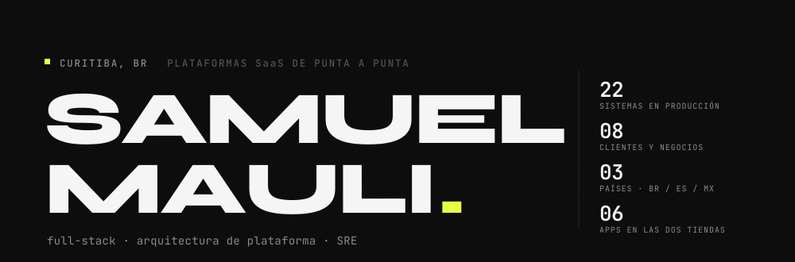

<picture>
  <source media="(prefers-color-scheme: dark)" srcset="./.github/assets/header-es-dark.svg">
  <source media="(prefers-color-scheme: light)" srcset="./.github/assets/header-es-light.svg">
  
</picture>

[Português](./README.md) · [English](./README.en.md) · **Español**

**[Portafolio](https://samuelmauli.github.io/portifolio/)** · [LinkedIn](https://www.linkedin.com/in/samuelmauli/) · [samuel.mauli@gmail.com](mailto:samuel.mauli@gmail.com) · Curitiba, Brasil

---

Llevo producto del diseño a producción — y después lo mantengo en pie. Elijo lenguaje por el problema: **Go** donde la idempotencia y concurrencia pesan (pago, facturación), **Python** donde mandan datos y ML (PostGIS, XGBoost, vLLM), **Node/TypeScript** donde front y back comparten tipo. IA sólo donde mueve número — y de preferencia **dentro del perímetro del cliente** (ONNX en proceso, vLLM on-premise, BYOK). Y opero lo que construyo: observabilidad completa y restore probado, no presumido.

## Resultados que entregué

| Entrega | Número |
|---|---|
| Conformidad ambiental rural (9 bases federales) → certificado firmado | **semanas → < 5 min** |
| Extracción documental con LLM en ERP bancario | **8 min → 10 s** por documento |
| Restore de producción con PITR probado | **a 1,2 s del objetivo · RTO 38 min** |
| Apps publicadas y mantenidas en las dos tiendas | **6 apps · iOS + Android** |
| Captura de factura de energía con integración en contingencia | **3 fuentes · cero gap de facturación** |
| Pago en lote con idempotencia y trilha inmutable | **0 pago en duplicidad** |

---

## Sectores en los que entrego

No escribo software genérico: cada producto carga la norma, el órgano y el vocabulario de su sector.

| Sector | Dominio | Regulación / fuente oficial |
|---|---|---|
| **Agro / ESG** | Certificación socioambiental rural, trazabilidad de cadena | Ley 12.651/12 · CAR · PRODES/DETER · IBAMA · INCRA · FUNAI · EUDR |
| **Sector público** | Licitación, contratación pública, fomento | Ley 14.133/21 · PNCP · Comprasnet · TCU |
| **Financiero** | Orquestación de pago a escala, conciliación | PIX (Bacen) · CNAB 240 · mTLS por banco · trilha inmutable |
| **Jurídico/contable** | Provisión de riesgo procesal, depósito judicial | CPC 25 / IAS 37 · DataJud/CNJ · PROJUDI · ICP-Brasil A1 |
| **Energía** | Generación distribuida por suscripción, prorrateo en condominio | Factura de distribuidora · bandera tarifaria · medición individual |
| **Salud ocupacional** | Riesgo psicosocial y plan de acción de RH | NR-01 · COPSOQ III · LGPD con dato sensible |
| **Movilidad** | Transporte escolar: responsable, conductor, ruta | LGPD con menor · consentimiento versionado en backend |
| **Industria/logística** | Portería, agendamiento de carga, control de acceso | Validación de NF-e · trilha de visitante |

---

## En producción

Mantengo sistemas en producción en varios sectores — agro y ESG, sector público, financiero, jurídico, energía, salud ocupacional, movilidad e industria. El trabajo va de APIs y plataformas web a aplicaciones móviles publicadas en las dos tiendas, siempre del diseño a la operación.

---

## Principios

- **Integridad** — hago lo correcto aunque nadie esté mirando, y no prometo lo que no puedo entregar.
- **Comunicación** — digo temprano lo que sé y lo que no; alinear expectativas es parte del trabajo, no una interrupción.
- **Transparencia** — muestro el progreso real, incluso lo que salió mal. Sin maquillar el estado.
- **Compromiso** — soy dueño del resultado, no solo de mi parte; me quedo hasta que la entrega se sostenga sola.
- **Respeto** — por el tiempo, el contexto y las personas de cada equipo con el que trabajo.

---

## Stack

| Capa | Herramientas |
|---|---|
| **Lenguajes** | Go · TypeScript · Python · Java · PHP · Dart · Rust · C++ · Kotlin · Swift · SQL |
| **Backend** | NestJS · Node · FastAPI · Flask · Spring Boot · Hibernate/JPA · Laravel · Slim · Go (hexagonal, River) |
| **Front** | Next.js · React · Vue · Tailwind · Turborepo · PWA · Vite |
| **Móvil** | React Native (bare + Expo Router) · Flutter · SwiftUI · Jetpack Compose · APNs · FCM · ASC + Play Developer API |
| **Datos** | PostgreSQL · PostGIS · pgvector · MySQL · MongoDB · Redis · DuckDB · Redshift · Prisma · Drizzle · Airflow |
| **IA / ML** | XGBoost · LightGBM · SHAP · scikit-learn · TensorFlow · PyTorch · OpenCV · ONNX Runtime · vLLM · Ollama · BGE-M3 · RAG (BM25 + embeddings) · Claude / GPT / Gemini / Groq |
| **Infra / SRE** | Docker · Kubernetes / k3s · Caddy · Nginx · PM2 · GitHub Actions · AWS · Cloudflare · Prometheus · Grafana · Loki · Alertmanager · PITR |
| **Integraciones** | PIX · CNAB 240 · mTLS · SFTP · Asaas · Stripe · Banco Inter · RabbitMQ · WebSocket · ICP-Brasil A1 · DataJud/CNJ · PNCP/Comprasnet |
| **Calidad** | Playwright · Jest · Vitest · pytest · JUnit |

---

## En GitHub

| Repositorio | |
|---|---|
| [**GreenChain**](https://github.com/SamuelMauli/GreenChain-Backend) | Trazabilidad en Hyperledger Fabric + geoprocesamiento para conformidad EUDR ([front](https://github.com/SamuelMauli/GreenChain-Frontend)) |
| [**Quimera**](https://github.com/SamuelMauli/Quimera) | Motor de ajedrez en C++ con modelado predictivo del oponente |
| [**Rust-LavaLamp**](https://github.com/SamuelMauli/Rust-LavaLamp) | Entropía criptográfica por imagen, en la línea del LavaRand de Cloudflare |
| [**Curitiba-Verde**](https://github.com/SamuelMauli/Curitiba-Verde) | Mapeo de deforestación por visión computacional y NDVI |
| [**LibrasNow**](https://github.com/SamuelMauli/LibrasNow) | Traducción de lengua de signos en tiempo real en el borde |
| [**wselect-pro**](https://github.com/SamuelMauli/wselect-pro) | LMS en producción, despliegue por GitHub Actions |
| [**EBANX Take-Home**](https://github.com/SamuelMauli/EBANX-Take-Home-API) | API bancaria en PHP 8.2 + Slim 4 |

---

## Trayectoria

```
2025 →      Desarrollador Pleno · Grupo Negócios Públicos (Vanlink)
            SGI + CRM, 2 apps Flutter en las tiendas, orquestación de pago,
            extracción documental con LLM: 8 min → 10 s por documento

2024 →      Developer & Consultor · Doublethree
            Productos propietarios del diseño a la producción,
            apps publicadas en las tiendas

2024–2025   Java & PHP Developer · Meisters Solutions
            Spring Boot y Laravel, ETL/ELT para farmacéutica,
            BlauSight (IA generativa) y Ballesol CareAI (España)

2023–2024   Agente de Soporte TI · Positivo Tecnologia — ITIL, SLA, backlog de IMC
2023        Consultor Oracle · TRI CS Inc. — OIC, BI Publisher, REST/SOAP
2022–2023   Soporte N1 · ICI Curitiba — Municipalidad de Curitiba, NOC y campo
```

Trilingüe (PT · EN · ES), con software en producción en Brasil, España y México.

---

Abierto a proyecto desafiante y asociación — [samuel.mauli@gmail.com](mailto:samuel.mauli@gmail.com)
