<picture>
  <source media="(prefers-color-scheme: dark)" srcset="./.github/assets/header-dark.svg">
  <source media="(prefers-color-scheme: light)" srcset="./.github/assets/header-light.svg">
  
</picture>

**[Portfólio](https://samuelmauli.github.io/portifolio/)** · [LinkedIn](https://www.linkedin.com/in/samuelmauli/) · [samuel.mauli@gmail.com](mailto:samuel.mauli@gmail.com) · Curitiba, PR · PT / EN / ES

---

Levo produto do desenho à produção — e depois mantenho no ar.

Escolho a linguagem pelo problema, não pela moda: **Go** onde idempotência e concorrência importam (orquestração bancária, faturamento), **Python** onde o ecossistema de dados e ML manda (PostGIS, XGBoost, vLLM), **Node/TypeScript** onde o time inteiro compartilha tipo com o front. No mobile, **React Native** e **Flutter**, com seis apps publicados nas duas lojas — incluindo os casos difíceis: APNs direto quando o Firebase corrompeu no iOS, build assinado sem pipeline gerenciado.

Aplico IA onde ela resolve algo mensurável, e de preferência **dentro do perímetro do cliente**: embeddings multilíngues em ONNX Runtime no próprio processo Node, LLM servido por vLLM on-premise, XGBoost com SHAP obrigatório quando a decisão vai para auditoria.

Também sou o SRE da própria operação: migrei tudo de EC2 para VPS, hoje ~20 processos de oito negócios atrás de Caddy, com Prometheus/Grafana/Loki e **PITR provado** — restore parou a `1,2s` do alvo, RTO medido em `38min`. Backup sem restore testado eu não chamo de backup.

---

## Stack

| Camada | Ferramentas |
|---|---|
| **Linguagens** | Go · TypeScript · Python · Java · PHP · Dart · Rust · C++ · Kotlin · Swift · SQL |
| **Backend** | NestJS · Node · FastAPI · Flask · Spring Boot · Hibernate/JPA · Laravel · Slim · Go (hexagonal, River) |
| **Front-end** | Next.js · React · Vue · Tailwind · Turborepo · PWA · Vite |
| **Mobile** | React Native (bare + Expo Router) · Flutter · SwiftUI · Jetpack Compose · APNs · FCM · ASC API + Play Developer API |
| **Dados** | PostgreSQL · PostGIS · pgvector · MySQL · MongoDB · Redis · DuckDB · Redshift · Prisma · Drizzle · Airflow |
| **IA / ML** | XGBoost · LightGBM · SHAP · scikit-learn · TensorFlow · PyTorch · OpenCV · ONNX Runtime · vLLM · Ollama · BGE-M3 · RAG (BM25 + embeddings) · Claude / GPT / Gemini / Groq |
| **Infra / SRE** | Docker · Kubernetes e k3s · Caddy · Nginx · PM2 · GitHub Actions · AWS · Cloudflare · Prometheus · Grafana · Loki · Alertmanager · PITR |
| **Integrações** | PIX · CNAB 240 · mTLS · SFTP · Asaas · Stripe · Banco Inter · RabbitMQ · WebSocket · ICP-Brasil A1 · DataJud/CNJ · PNCP / Comprasnet |
| **Qualidade** | Playwright · Jest · Vitest · pytest · JUnit |

---

## Setores em que entrego

Não escrevo software genérico: cada produto abaixo carrega a norma, o órgão e o vocabulário do seu setor.

| Setor | Domínio de negócio | Regulação e fonte oficial com que lido |
|---|---|---|
| **Agronegócio / ESG** | Certificação socioambiental de imóvel rural, rastreabilidade de cadeia | Código Florestal (Lei 12.651/12) · CAR · PRODES / DETER · IBAMA · INCRA · FUNAI · ICMBio · EUDR |
| **Setor público** | Licitação, contratação pública, capital e fomento | Lei 14.133/21 · PNCP · Comprasnet · jurisprudência do TCU |
| **Financeiro** | Orquestração de pagamento em escala, conciliação bancária | PIX (Bacen) · CNAB 240 · mTLS por conexão bancária · trilha de auditoria imutável |
| **Jurídico e contábil** | Provisão de risco processual, depósito judicial e alvará | CPC 25 / IAS 37 · DataJud/CNJ · PROJUDI · assinatura ICP-Brasil A1 |
| **Energia** | Geração distribuída por assinatura, rateio em condomínio | Fatura de distribuidora · bandeira tarifária · crédito de energia · medição individualizada |
| **Saúde ocupacional** | Risco psicossocial e plano de ação de RH | NR-01 · taxonomia COPSOQ III · LGPD com dado sensível |
| **Mobilidade** | Transporte escolar: responsável, condutor e rota | LGPD com menor de idade · consentimento versionado servido pelo backend |
| **Indústria e logística** | Portaria, agendamento de carga e controle de acesso | Validação de NF-e · credenciamento e trilha de visitante |

## Em produção

Produtos que arquitetei, construí e mantenho no ar — dez proprietários, mais as plataformas que lidero no Grupo Negócios Públicos.

| Produto | Setor | O que resolve | Stack |
|---|---|---|---|
| **Terra-fy** | Agronegócio / ESG | Certificado socioambiental de imóvel rural cruzando a geometria do CAR contra nove bases federais. PDF assinado com ICP-Brasil A1, QR e hash verificáveis, em menos de 5 min após o pagamento. | FastAPI · PostGIS · MapLibre · pyHanko |
| **Licitaqui** | Setor público | Lê os editais publicados no Brasil e entrega só os que a empresa pode ganhar, citando o trecho literal que prova cada afirmação. Análise multi-passe de habilitação e jurisprudência do TCU contra cada risco. | Next.js · pgvector · Playwright · LLM on-prem |
| **PaymentsHub** | Financeiro | Pagamento bancário em lote: pré-validação na API do banco, aprovação humana com RBAC, PIX REST ou CNAB 240 por SFTP auditado. Idempotência por pagamento e certificado mTLS versionado por conexão. | Go · PostgreSQL · River · MinIO |
| **Lexis Predict** | Jurídico e contábil | Classificação de risco processual para provisão sob CPC 25 / IAS 37, com IA 100% on-premise. SHAP obrigatório nas top-5 features; confiança abaixo de `0,70` vai para revisão humana. | Python · XGBoost · vLLM · k3s |
| **Lexis Vault** | Jurídico e financeiro | O extrato fala em ID de depósito, o tribunal fala em nº de processo — o Vault amarra os dois. CNAB 240 por SFTP, DataJud/CNJ e PROJUDI, conciliação em quatro camadas orquestrada em Airflow. | FastAPI · Airflow · Kubernetes |
| **OnMe** | Saúde ocupacional | Risco psicossocial corporativo em três superfícies sobre um backend só. Embeddings rodam em ONNX dentro do processo Node — nenhuma chamada a IA de terceiro com dado sensível. | NestJS · React Native · ONNX Runtime |
| **Wave Energia** | Energia | Energia por assinatura: app nas duas lojas mais a API da operação. Três integrações de distribuidora capturando fatura por contingência — quando uma falha, a outra assume. | React Native · Node.js · AWS |
| **AmperCondo** | Energia | Acaba com o rateio por fração ideal: medição individualizada, tarifa configurável e cobrança por unidade com baixa automática. Multi-tenant por schema, faturamento idempotente. | Go (hexagonal) · PostgreSQL · Asaas |
| **Aportia** | Capital e fomento | Monitora fontes oficiais de capital e calcula score de fit explicável critério a critério. BYOK: a chave de LLM é do cliente e a análise nunca sai da conta dele. | Next.js · Prisma · BM25 + embeddings |
| **Vanlink** | Mobilidade | Dois apps Flutter de transporte escolar em produção — responsáveis e condutores. Tracking em tempo real, consentimento LGPD servido pelo backend, geocoding com validação cruzada de escola. | Flutter · APNs · FCM |
| **LogiSentry** | Indústria e logística | Agendamento de caminhão, visitante e sala numa portaria só, com PWA de totem no tablet da recepção e operação multi-tenant. | Turborepo · NestJS · Next.js · Stripe |
| **Cadência** | Agências | CRM móvel white-label nas duas lojas: cada agência entra pelo próprio subdomínio, com a própria marca. | React Native · Expo Router · NestJS |

**Infra que sustenta tudo:** um VPS de 8 vCPU / 32 GB, ~20 processos de oito negócios atrás de Caddy com wildcard por DNS-01, observabilidade completa e PITR provado.

---

## Como eu trabalho

- **Dado sensível não sai do perímetro.** Saúde ocupacional, provisão contábil e análise de edital rodam com modelo local — ONNX no próprio processo, vLLM on-premise, ou BYOK com a chave do cliente. Privacidade como arquitetura, não como cláusula de contrato.
- **Dinheiro exige idempotência e trilha.** Nenhuma leitura é cobrada duas vezes, nenhum lote é pago duas vezes: chave de idempotência por pagamento, aprovação humana com RBAC e evento imutável do início ao fim.
- **Decisão automatizada precisa ser auditável.** Se a saída vai para uma auditoria, ela vem com explicação — SHAP nas features, citação literal do trecho do edital, hash verificável offline. Abaixo do limiar de confiança, quem decide é humano.
- **Backup sem restore testado não é backup.** PITR provado com `recovery_target_time`, RTO medido, não presumido.
- **Publicar app é ciclo completo.** Bump de versão, build assinado, upload por ASC API e Play Developer API, submissão à revisão — sem pipeline gerenciado no meio.

---

## No GitHub

| Repositório | |
|---|---|
| [**Quimera**](https://github.com/SamuelMauli/Quimera) | Engine de xadrez em C++ com modelagem preditiva do oponente |
| [**Rust-LavaLamp**](https://github.com/SamuelMauli/Rust-LavaLamp) | Entropia criptográfica por imagem, na linha do LavaRand da Cloudflare |
| [**GreenChain**](https://github.com/SamuelMauli/GreenChain-Backend) | Rastreabilidade blockchain + geoprocessamento para conformidade EUDR ([front](https://github.com/SamuelMauli/GreenChain-Frontend)) |
| [**Curitiba-Verde**](https://github.com/SamuelMauli/Curitiba-Verde) | Mapeamento de desmatamento por visão computacional e NDVI |
| [**LibrasNow**](https://github.com/SamuelMauli/LibrasNow) | Tradução de língua de sinais em tempo real na borda |
| [**wselect-pro**](https://github.com/SamuelMauli/wselect-pro) | LMS em produção, `106k` linhas, deploy por GitHub Actions |
| [**EBANX Take-Home**](https://github.com/SamuelMauli/EBANX-Take-Home-API) | API bancária em PHP 8.2 + Slim 4 |

---

## Trajetória

```
2025 →      Desenvolvedor Pleno · Grupo Negócios Públicos (Vanlink)
            SGI + CRM, dois apps Flutter nas lojas, orquestração de pagamento,
            extração documental com LLM: 8 min → 10 s por documento

2024 →      Developer & Consultor · Doublethree
            Dez produtos proprietários do desenho à produção, seis apps nas lojas,
            migração AWS → VPS e a operação inteira em pé

2024–2025   Java & PHP Developer · Meisters Solutions
            Spring Boot e Laravel, pipelines ETL/ELT para farmacêutica,
            BlauSight (IA generativa) e Ballesol CareAI

2023–2024   Agente de Suporte TI · Positivo Tecnologia — ITIL, SLA, backlog da IMC
2023        Consultor Oracle · TRI CS Inc. — OIC, BI Publisher, REST/SOAP
2022–2023   Suporte N1 · ICI Curitiba — Prefeitura de Curitiba, NOC e campo
```

---

Aberto a projeto desafiador e parceria — [samuel.mauli@gmail.com](mailto:samuel.mauli@gmail.com)
