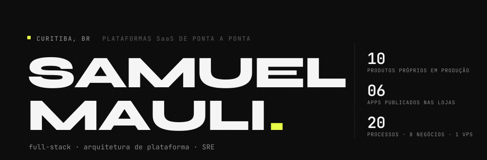

<picture>
  <source media="(prefers-color-scheme: dark)" srcset="./.github/assets/header-dark.svg">
  <source media="(prefers-color-scheme: light)" srcset="./.github/assets/header-light.svg">
  
</picture>

**Português** · [English](./README.en.md) · [Español](./README.es.md)

**[Portfólio](https://samuelmauli.github.io/portifolio/)** · [LinkedIn](https://www.linkedin.com/in/samuelmauli/) · [samuel.mauli@gmail.com](mailto:samuel.mauli@gmail.com) · Curitiba, PR

---

Levo produto do desenho à produção — e mantenho no ar. Escolho a linguagem pelo problema: **Go** onde idempotência e concorrência pesam (pagamento, faturamento), **Python** onde dados e ML mandam (PostGIS, XGBoost, vLLM), **Node/TypeScript** onde front e back compartilham tipo. IA só onde move número — e de preferência **dentro do perímetro do cliente** (ONNX no processo, vLLM on-premise, BYOK). E opero o que construo: observabilidade completa e restore testado, não presumido.

## Resultados que entreguei

| Entrega | Número |
|---|---|
| Conformidade ambiental rural (9 bases federais) → certificado assinado | **semanas → < 5 min** |
| Extração documental com LLM no ERP bancário | **8 min → 10 s** por documento |
| Restore de produção com PITR provado | **a 1,2 s do alvo · RTO 38 min** |
| Apps publicados e mantidos nas duas lojas | **6 apps · iOS + Android** |
| Captura de fatura de energia com integração em contingência | **3 fontes · zero gap de faturamento** |
| Pagamento em lote com idempotência e trilha imutável | **0 pagamento em duplicidade** |

---

## Setores em que entrego

Não escrevo software genérico: cada produto carrega a norma, o órgão e o vocabulário do seu setor.

| Setor | Domínio | Regulação / fonte oficial |
|---|---|---|
| **Agro / ESG** | Certificação socioambiental rural, rastreabilidade de cadeia | Lei 12.651/12 · CAR · PRODES/DETER · IBAMA · INCRA · FUNAI · EUDR |
| **Setor público** | Licitação, contratação pública, fomento | Lei 14.133/21 · PNCP · Comprasnet · TCU |
| **Financeiro** | Orquestração de pagamento em escala, conciliação | PIX (Bacen) · CNAB 240 · mTLS por banco · trilha imutável |
| **Jurídico/contábil** | Provisão de risco processual, depósito judicial | CPC 25 / IAS 37 · DataJud/CNJ · PROJUDI · ICP-Brasil A1 |
| **Energia** | Geração distribuída por assinatura, rateio em condomínio | Fatura de distribuidora · bandeira tarifária · medição individual |
| **Saúde ocupacional** | Risco psicossocial e plano de ação de RH | NR-01 · COPSOQ III · LGPD com dado sensível |
| **Mobilidade** | Transporte escolar: responsável, condutor, rota | LGPD com menor · consentimento versionado no backend |
| **Indústria/logística** | Portaria, agendamento de carga, controle de acesso | Validação de NF-e · trilha de visitante |

---

## Em produção

Mantenho sistemas no ar em vários setores — agro e ESG, setor público, financeiro, jurídico, energia, saúde ocupacional, mobilidade e indústria. O trabalho vai de APIs e plataformas web a aplicativos mobile publicados nas duas lojas, sempre do desenho à operação.

---

## Princípios

- **Integridade** — faço o certo mesmo quando ninguém está olhando, e não prometo o que não posso entregar.
- **Comunicação** — digo cedo o que sei e o que não sei; alinhar expectativa é parte do trabalho, não interrupção dele.
- **Transparência** — mostro o progresso real, inclusive o que deu errado. Sem maquiar status.
- **Compromisso** — sou dono do resultado, não só da minha parte; fico até a entrega ficar de pé.
- **Respeito** — com o tempo, o contexto e as pessoas de cada time com quem trabalho.

---

## Stack

| Camada | Ferramentas |
|---|---|
| **Linguagens** | Go · TypeScript · Python · Java · PHP · Dart · Rust · C++ · Kotlin · Swift · SQL |
| **Backend** | NestJS · Node · FastAPI · Flask · Spring Boot · Hibernate/JPA · Laravel · Slim · Go (hexagonal, River) |
| **Front** | Next.js · React · Vue · Tailwind · Turborepo · PWA · Vite |
| **Mobile** | React Native (bare + Expo Router) · Flutter · SwiftUI · Jetpack Compose · APNs · FCM · ASC + Play Developer API |
| **Dados** | PostgreSQL · PostGIS · pgvector · MySQL · MongoDB · Redis · DuckDB · Redshift · Prisma · Drizzle · Airflow |
| **IA / ML** | XGBoost · LightGBM · SHAP · scikit-learn · TensorFlow · PyTorch · OpenCV · ONNX Runtime · vLLM · Ollama · BGE-M3 · RAG (BM25 + embeddings) · Claude / GPT / Gemini / Groq |
| **Infra / SRE** | Docker · Kubernetes / k3s · Caddy · Nginx · PM2 · GitHub Actions · AWS · Cloudflare · Prometheus · Grafana · Loki · Alertmanager · PITR |
| **Integrações** | PIX · CNAB 240 · mTLS · SFTP · Asaas · Stripe · Banco Inter · RabbitMQ · WebSocket · ICP-Brasil A1 · DataJud/CNJ · PNCP/Comprasnet |
| **Qualidade** | Playwright · Jest · Vitest · pytest · JUnit |

---

## No GitHub

| Repositório | |
|---|---|
| [**GreenChain**](https://github.com/SamuelMauli/GreenChain-Backend) | Rastreabilidade em Hyperledger Fabric + geoprocessamento para conformidade EUDR ([front](https://github.com/SamuelMauli/GreenChain-Frontend)) |
| [**Quimera**](https://github.com/SamuelMauli/Quimera) | Engine de xadrez em C++ com modelagem preditiva do oponente |
| [**Rust-LavaLamp**](https://github.com/SamuelMauli/Rust-LavaLamp) | Entropia criptográfica por imagem, na linha do LavaRand da Cloudflare |
| [**Curitiba-Verde**](https://github.com/SamuelMauli/Curitiba-Verde) | Mapeamento de desmatamento por visão computacional e NDVI |
| [**LibrasNow**](https://github.com/SamuelMauli/LibrasNow) | Tradução de língua de sinais em tempo real na borda |
| [**wselect-pro**](https://github.com/SamuelMauli/wselect-pro) | LMS em produção, deploy por GitHub Actions |
| [**EBANX Take-Home**](https://github.com/SamuelMauli/EBANX-Take-Home-API) | API bancária em PHP 8.2 + Slim 4 |

---

## Trajetória

```
2025 →      Desenvolvedor Pleno · Grupo Negócios Públicos (Vanlink)
            SGI + CRM, 2 apps Flutter nas lojas, orquestração de pagamento,
            extração documental com LLM: 8 min → 10 s por documento

2024 →      Developer & Consultor · Doublethree
            Produtos proprietários do desenho à produção,
            apps publicados nas lojas

2024–2025   Java & PHP Developer · Meisters Solutions
            Spring Boot e Laravel, ETL/ELT para farmacêutica,
            BlauSight (IA generativa) e Ballesol CareAI (Espanha)

2023–2024   Agente de Suporte TI · Positivo Tecnologia — ITIL, SLA, backlog da IMC
2023        Consultor Oracle · TRI CS Inc. — OIC, BI Publisher, REST/SOAP
2022–2023   Suporte N1 · ICI Curitiba — Prefeitura de Curitiba, NOC e campo
```

Trilíngue (PT · EN · ES), com software em produção no Brasil, na Espanha e no México.

---

Aberto a projeto desafiador e parceria — [samuel.mauli@gmail.com](mailto:samuel.mauli@gmail.com)
